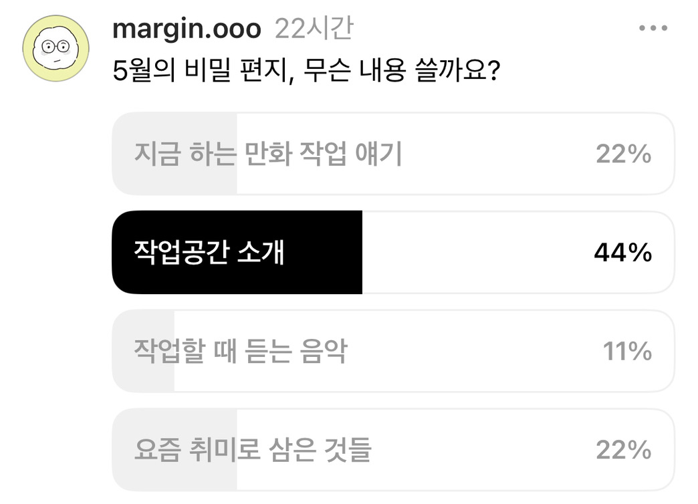

#  작업공간 대공개!  #
### 용기내서 보여드립니다, 날것 그대로 ###

  

고백할 게 하나 있어요. 대부분 저를 인스타그램을 통해 알게 되셨을텐데요,<i>요즘은 인스타그램보다 스레드를 많이 해요. </i>
만화 그리는 것보다 글을 쓰는 게 아무래도 부담이 적더라고요. 작업 소회나 혼잣말을 두서없이 올리고 있습니다.

이번에는 스레드에서 간단한 설문조사를 해봤어요. 아홉 분이 설문에 답해주셨지요.

  

'비밀편지'가 뭔지 설명도 안 드렸는데 투표해주신 아홉 명의 천사들
편지에 뭘 적을지 몰라서 올린 설문인데 항목을 스스로 정해야 하는 고통... 마침
정희정 작가님
이 작업공간 소개하는 릴스를 올리셨기에 별 생각 없이 '작업공간 소개'를 끼워넣었어요. 그게 1위를 할 줄이야.
여기서 별 근거 없는 저만의 작은 이론을 소개드리자면, 디자인 계열이 감각적으로 정리를 잘 하고 미술 계열은 대체로 물건이 많고 정신없습니다. 디자인 계열은 아무래도 그리드가 기본이 되어서 그런가봐요(디자인 잘 모르고 아무렇게나 말하는 중). 미술 계열은 의식의 흐름을 현실 공간에 구현한 듯한 자유로운 배치를 선보이고요.
전 굳이 분류하면 미술 계열이라 그런지 정리를 괴멸적으로 못합니다. 친구가 '넌 그림을 잘 그리니까 공간지각력이 좋을 거 같아!'라고 말했지만, 스마트폰과 네이버 지도의 보급이 일반화되기 전까지 저는 항상 길을 잃었습니다. '거기 어디야?'라고 물으면 '길 옆이야!'라고 대답해왔죠.
그런고로 감각적이고 깔끔한 데스크테리어는 아직까지 정복하지 못한 분야입니다. 이런 성향이라면 차라리 밖에 뛰쳐 나갔을 때 작업이 잘 되면 좋을텐데, 슬프게도 저는 밖에 나가는 걸 별로 좋아하지 않습니다.
나가기 위해 씻고 옷을 차려입어야 한다는 게 귀찮고, 중간중간 누울 수 없는 게 괴롭습니다. 음악, 소음, 냄새 등 제가 컨트롤할 수 없는 요소도 너무 많고요.
그리하여 저의 작업 공간은 언제나 집.
만화 작업을 본격적으로 시작한 것은 자취를 한지 몇 년 지난 시점이었어요. 자취집을 처음 꾸릴 때에는 작업 공간에 대한 니즈가 전혀 없어서, 4인용 식탁을 아울렛에서 저렴하게 구비하고 만족스러워했습니다.

친구들의 집들이 행렬도 잦아들어 버찌와 둘이서 4인용 공간을 독점하던 시절
이 테이블에서는 밥도 먹고, 뜨개질도 하고, 노트북으로 영화나 드라마도 보았지요. 거의 취미생활 테이블이었습니다.
본격적인 작업이 이루어진 것은 버찌가 집에 들어오고 조금 후. 퇴근 후 버찌 저녁을 먹이고, 산책을 하고, 같이 누워 있다가 버찌가 잠들면 마지막 산책 시간이 될 때까지 테이블에서 만화를 그렸어요.
인스타툰을 그린지 1년 후에는 현관을 마주보는 4인 세팅이었던 테이블 방향도 틀어버렸습니다. 벽에 딱 붙게요. 현관을 바라보며 작업하는 게 영 불안정했거든요. 방에 있던 스탠딩 데스크를 밖으로 빼서 전자렌지와 영양제도 정리해두었죠. 이랬더니 훨씬 아늑해지더라고요.

전자렌지 위 동그란 거 두 개는... 사과입니다
테이블 유리의 빛 반사가 너무 심해서 데스크 패드도 깔아두고, 노란 간접등만 있던 터라 주광색 전구를 끼운 작업등도 이케아에서 주문해 설치해두자 작업 공간 구색이 완전히 갖춰졌습니다. 일러스트도 해보려고 하던 때라 색연필이 나와 있네요.

지금 보니 추억이 샘솟는군요. 새벽에 일어나 커피를 끓인 다음, 저 자리에 앉아서 다이어리를 쓰고, 명상을 하고, 작업에 들어갔죠. 해가 환하게 뜨면 버찌랑 아침 산책을 나갔습니다.
그렇게 혼자서 2년, 버찌와 2년을 지내다 전세 계약 종료로 집을 나오게 됩니다. 그 때가 21년. 한참 패닉 바잉으로 집값이 치솟을 때에요. 안 그래도 주변 전세가가 두 배 이상 올랐는데 개와 함께 살 집을 구하기가 여의치 않았습니다.
매일 중개사님이랑 전세집 보러 다니다가 ‘이럴 바엔 매매해버릴까?’고 마음이 바뀌고, 저도 패닉 바잉 대열에 참여하여 딱히 회사와 가깝지도, 본가와 가깝지도 않은 저 먼 변방의 아파트를 매수하였고…. 그런데 그 집은 전세 대항권이 있는 집이었고…. 이래저래 복잡한 사정으로 본가로 들어오게 됩니다.
본가에는 고등학생 때부터 쓰던, 혼란과 혼돈이 누적된 책상이 있었습니다. 몇 차례 정리를 거쳐 현재의 모습에 이르게 되었어요.

믿어주세요. 정리된 거에요.
책상의 흰 면이 보이잖아요.
회사에서도 똑같은 게, 자리 바꿀 때 짐을 정리해보면 정작 한 박스밖에 안 나오는 주제에 책상 위는 정신머리가 하나도 없습니다. 적은 물건을 효율적으로 지저분하게 배치하는 재주가 있나봐요 저는.
현재의 세팅은 이렇습니다.
▪️
데스크패드
고등학생 때부터 쓰던 것. 오래 가네요.
▪️
와이드 LED 조명
올해 구입했습니다. 조명이 책상 전체에 고르게 내려와 만족해요. 제품명은
브로드윙 L(LSP 9300)
입니다.
▪️
노트북, 아이패드 거치대
만컴즈 Z스탠드
두 번째 버전입니다. 첫 번째 버전을 잘 쓰다가 회사에 갖다두고 집에선 업그레이드 버전을 써요. 그림 그릴 때 안 흔들리고 안정적이에요.
▪️
노트북, 아이패드 수직 거치대
첫 사진 우측에 있는 건데요(잘 안 보이시겠지만), 아이패드를 쓸 땐 노트북을 수직으로 거치해두고, 노트북 쓸 땐 아이패드를 수직 거치해둡니다.
이킵먼트
꺼고 이것도 공간 활용하기 좋아요.
▪️ 아이패드
아이패드 프로 3세대 11인치
입니다. 요즘 슬슬 배터리가 전보다 빨리 닳아서 슬퍼요.
▪️
노트북
맥북 프로 M1 13인치
입니다. 20년인가 21년에 영상 해보겠다고 나대다가 맥북 에어 보상판매하고 바꿨습니다. 영상은 핸드폰으로 앱 써서 만드는 게 제일 쉽더라고요.
▪️
블루투스 키보드
클립스튜디오로 작업하기 때문에 단축키 필수라 정말 여러 종류를 써봤는데요, 접이식이고 경량이고 다 필요 없고 이게 최고입니다.
로지텍 K380
. 제가 가방에 막 넣고 다녀서 F 키가 두 개 빠졌지만 문제 없이 잘 씁니다.
책상은 비밀편지 외 다른 어떤 데서도 공개 못 할 것 같아요. 부끄러움을 참고 사진을 찍었는데 어떠신가요? 나중에 이사하게 되면 그 때야말로 이를 갈고 멋진 작업 환경을 갖춰보겠습니다.
다음 편지 예고
회사, 책상, 침대만 전전하는 마진오가 요즘 취미로 삼은 일들은?
힌트: 음양오행, 그리고 AI.
5월 21일에 만나요!

📒 지난 편지들 보기
📒 더 알고 싶은 주제 보내기

마진오의 비밀편지
ask.omagine@gmail.com
수신거부
Unsubscribe

이 메일은 스티비로 만들었습니다